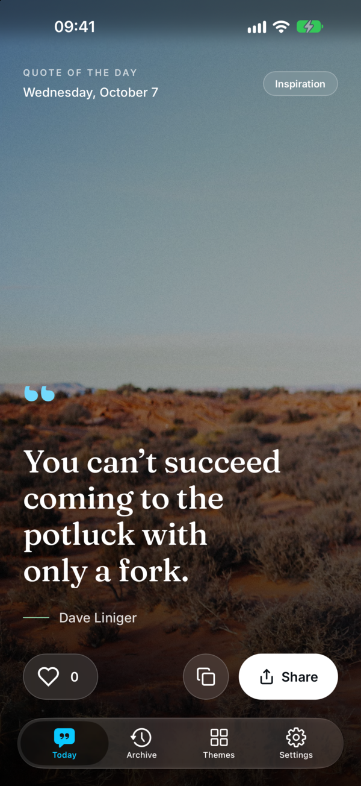
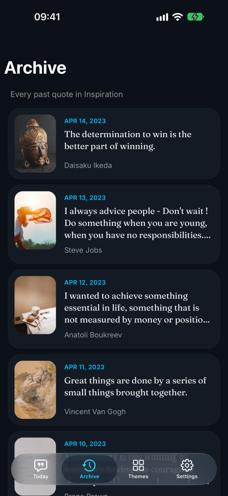
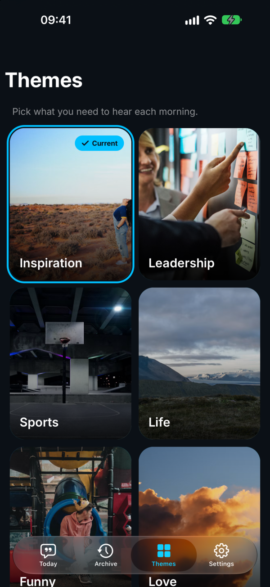
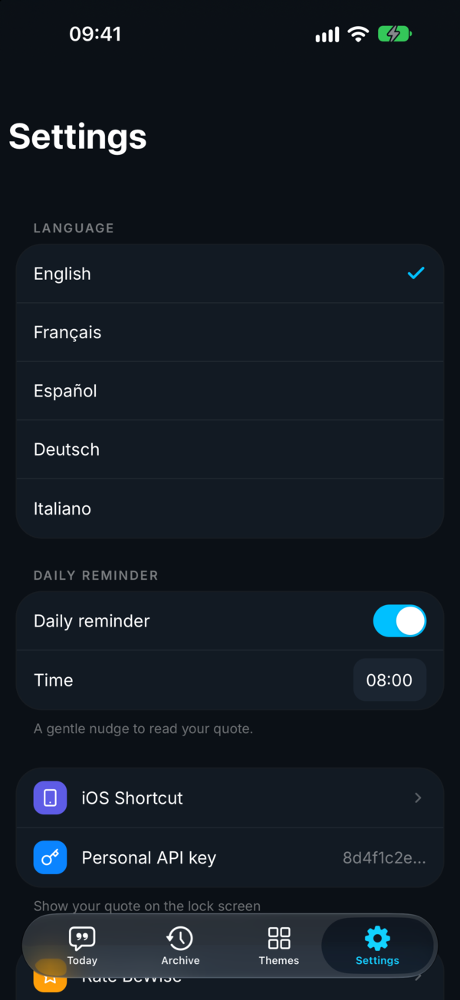

# BeWise

One wise quote a day. Open source showcase of a modern Capacitor app, built and shipped by [Capgo](https://capgo.app).

<a href="https://apps.apple.com/app/id1448918843">App Store</a> · <a href="https://bewise.love">bewise.love</a>

| Today | Archive | Themes | Settings |
| --- | --- | --- | --- |
|  |  |  |  |

## What it shows

- **Capacitor 8** app written in Vue 3 + Tailwind 4, no UI framework.
- **Native tab bar and nav bar** (iOS 26 Liquid Glass, Android Material) with [`@capgo/capacitor-native-navigation`](https://github.com/Cap-go/capacitor-native-navigation).
- **Native-feeling page transitions** and iOS swipe back with [`@capgo/capacitor-transitions`](https://github.com/Cap-go/capacitor-transitions).
- **Live updates** with [`@capgo/capacitor-updater`](https://github.com/Cap-go/capacitor-updater): JavaScript-only changes reach users in minutes, no store review.
- **Automatic store releases**: CI asks Capgo whether a change needs a native build (`capgo build needed`). If yes, Capgo Cloud Build compiles, signs and uploads to App Store Connect and Google Play. If not, it ships an OTA bundle.
- **Cloudflare backend**: Hono API on Workers + D1 (87k quotes migrated from Supabase/Firebase), a daily cron that schedules the quote of the day, Astro website on Workers static assets.

## Layout

```
apps/mobile    Vue 3 + Capacitor 8 app (ios/, android/)
apps/api       Cloudflare Worker + D1 (api.bewise.love)
apps/website   Astro site (bewise.love)
```

## Develop

```bash
bun install
bun run dev                      # web preview of the app (browser tab bar fallback)
bun --cwd apps/api dev           # local API with a local D1
bun --cwd apps/website dev       # website
bun --cwd apps/mobile sync       # build web + cap sync
bunx cap open ios                # from apps/mobile
```

## Release

Push to `main`:

| Change | What happens |
| --- | --- |
| `apps/mobile/**` JS/CSS only | Capgo OTA bundle on the `Production` channel |
| native dependency or `ios/`/`android/` change | Capgo Cloud Build → App Store Connect + Google Play |
| `apps/api/**` | `wrangler deploy` + D1 migrations |
| `apps/website/**` | `wrangler deploy` of the static site |

Store listing text and screenshots live in `store/` (`bun store/app-store.ts <version>` pushes them to App Store Connect). "What's new" for each release comes from `store/metadata/*.json`.

Required GitHub secrets: `CAPGO_TOKEN`, `CLOUDFLARE_API_TOKEN`, `CLOUDFLARE_ACCOUNT_ID` (org secrets), and for native builds `BUILD_CERTIFICATE_BASE64`, `P12_PASSWORD`, `CAPGO_IOS_PROVISIONING_MAP`, `APPLE_KEY_ID`, `APPLE_ISSUER_ID`, `APPLE_KEY_CONTENT`, `APP_STORE_CONNECT_TEAM_ID`, `ANDROID_KEYSTORE_FILE`, `KEYSTORE_KEY_ALIAS`, `KEYSTORE_KEY_PASSWORD`, `KEYSTORE_STORE_PASSWORD`, `PLAY_CONFIG_JSON`.

## License

MIT
